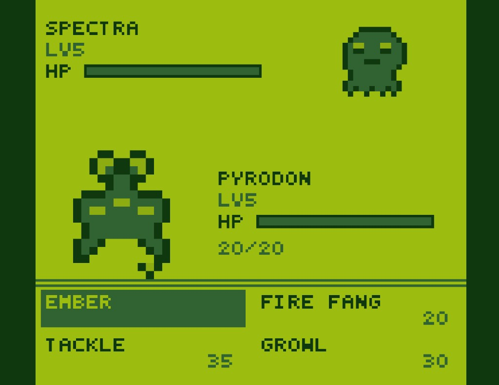

# DOkemon

DOkemon is a retro-inspired, browser-based monster battle game where players build a roster, create original creatures, and fight in turn-based battles.

Built for fast iteration and real-time multiplayer architecture, it combines a React front-end with Cloudflare Workers + Durable Objects for server-authoritative game state.



## Why This Project

DOkemon aims to capture the feel of classic handheld monster battles while being fully web-native:

- quick onboarding and instant play in-browser
- custom creature creation with meaningful build choices
- deterministic battle logic that can scale to online sessions
- a visual identity that feels nostalgic but original

## Current Gameplay

- Create custom DOkemon with sprite, type, stat spread, and move set
- Auto-seed a starter roster on first play
- Browse your collection and choose fighters
- Run battles in CPU mode and multiplayer-ready battle flow
- Maintain per-player progression data (including rating)

## Tech Stack

- Frontend: React + Vite + TypeScript
- Backend: Cloudflare Workers
- Stateful game entities: Durable Objects (SQLite-backed classes)
- Tooling: Wrangler, Vitest

## Architecture at a Glance

- `src/client/` UI screens, game flow, hooks, and pixel/canvas rendering
- `src/worker/` Worker entrypoint, API router, battle engine, Durable Object classes
- `src/shared/` Shared types, constants, protocol, presets, and move data
- `test/` Battle engine tests

Durable Objects model core game entities:

- `DOkemonDO` creature state and snapshots
- `PlayerDO` player roster + rating data
- `BattleDO` active battle state and turns
- `LobbyDO` matchmaking/lobby coordination

## Local Development

### Prerequisites

- Node.js 20+
- npm

### Install

```bash
npm install
```

### Start development

```bash
npm run dev
```

### Run tests

```bash
npm test
```

### Build

```bash
npm run build
```

## Deployment (Cloudflare Workers)

```bash
npm run deploy
```

`wrangler.jsonc` defines:

- Worker entrypoint
- SPA asset handling
- Durable Object bindings
- migration history (`v1`)

## API Surface

Defined in `src/worker/router.ts`:

- `POST /api/dokemon` create a DOkemon
- `GET /api/dokemon/:id` fetch DOkemon snapshot
- `GET /api/collection` list the player collection
- `POST /api/seed` create starter roster for new players
- `GET /api/player/rating` fetch player rating

Most player-scoped endpoints use `X-Player-Id`.

## Security Notes

- Local and sensitive files are git-ignored (`.env*`, `.dev.vars`, `.claude/`, and more)
- No production secrets are committed in this repository
- Use environment variables or Cloudflare-managed secrets for deployment credentials

## Roadmap Ideas

- ranked matchmaking and seasonal ladders
- expanded move/status effect interactions
- richer animation and battle feedback
- replay/share links for completed battles
- progression loops beyond collection (badges, quests, events)

## License

No `LICENSE` file is included yet. If you want this to be openly reusable, add one (MIT is a common default).
